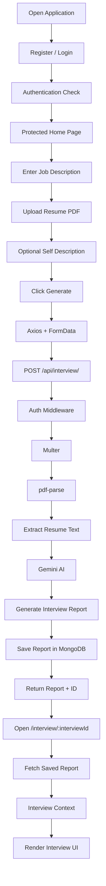

# GenAI Interview Preparation Platform

> An AI-powered interview preparation platform that connects a candidate's resume, a target job description, and Gemini AI to create a personalized interview strategy.

##  What is this project?

The idea is simple: instead of only telling a candidate whether their resume matches a job, the application also explains **what they should prepare before the interview**.

A user can:

- Create an account and log in
- Enter a target job description
- Upload a resume PDF
- Add an optional self-description
- Generate an AI-powered interview report
- View technical and behavioral interview questions
- See missing or weak skills
- Follow a day-wise preparation roadmap
- Generate a tailored resume as a PDF

### The basic idea

```text
Resume + Job Description + Self Description
                    ↓
               Gemini AI
                    ↓
        Personalized Interview Report
                    ↓
 ┌─────────────────────────────────────────┐
 │ Match Score                             │
 │ Technical Questions                     │
 │ Behavioral Questions                    │
 │ Skill Gaps                              │
 │ Preparation Roadmap                     │
 └─────────────────────────────────────────┘
```

---

#  Why I built it

A resume match score alone does not tell a candidate what to do next.

This project is built around three practical questions:

```text
1. How well does my profile match this role?
2. What skills or areas am I missing?
3. What should I prepare before the interview?
```

The application brings these answers together in one place.

---

#  Main Features

## 🔐 Authentication

- User registration
- User login
- User logout
- JWT-based authentication
- Protected frontend routes
- User-specific interview reports

## 📄 Resume Processing

- Upload resume as a PDF
- Receive the file through multipart form data
- Process the uploaded file with Multer
- Extract resume text using `pdf-parse`

## 🤖 AI Interview Analysis

Gemini analyzes:

```text
Resume
+
Self Description
+
Job Description
```

and generates:

- Resume-JD match score
- Technical interview questions
- Behavioral interview questions
- Skill gaps
- Preparation roadmap

##  Personalized Roadmap

The generated report contains day-wise preparation such as:

```text
Day 1 → System Design Fundamentals
Day 2 → Docker & Containerization
Day 3 → Cloud & AWS Basics
Day 4 → Advanced Node.js & Database Optimization
Day 5 → Mock Interviews & Revision
```

The actual roadmap changes according to the candidate and target job.

## 📑 Tailored Resume PDF

The application can also generate a resume tailored to the selected job.

The flow is:

```text
Saved Interview Report
        ↓
Gemini generates resume HTML
        ↓
Puppeteer converts HTML
        ↓
A4 PDF
        ↓
Browser downloads PDF
```

---

# 🧩 Tech Stack

## Frontend

- React.js
- React Router
- Axios
- SCSS
- Vite

## Backend

- Node.js
- Express.js
- Mongoose
- MongoDB
- JWT
- bcrypt
- Multer
- `pdf-parse`
- Puppeteer
- Zod

## AI

- Google Gemini API
- `@google/genai`

---

# 🏗️ Architecture

```text
                         ┌───────────────────────┐
                         │      React Frontend   │
                         │     localhost:5173    │
                         └───────────┬───────────┘
                                     │
                                     │ Axios / HTTP
                                     ▼
                         ┌───────────────────────┐
                         │     Express Backend   │
                         │     localhost:3000    │
                         └───────┬───────┬───────┘
                                 │       │
                      ┌──────────┘       └───────────┐
                      ▼                              ▼
             ┌────────────────┐             ┌────────────────┐
             │ MongoDB        │             │ Gemini AI      │
             │ Users/Reports  │             │ Analysis/HTML  │
             └────────────────┘             └───────┬────────┘
                                                   │
                                                   ▼
                                           ┌────────────────┐
                                           │ Puppeteer      │
                                           │ HTML → PDF     │
                                           └────────────────┘
```

---

# 🔄 Complete Application Workflow



---

# 📁 Project Structure

```text
GEN AI/
│
├── Backend/
│   ├── src/
│   │   ├── config/
│   │   │   └── database.js
│   │   │
│   │   ├── controllers/
│   │   │   ├── auth.controller.js
│   │   │   └── interview.controller.js
│   │   │
│   │   ├── middlewares/
│   │   │   ├── auth.middleware.js
│   │   │   └── file.middleware.js
│   │   │
│   │   ├── models/
│   │   │   ├── user.model.js
│   │   │   ├── blacklist.model.js
│   │   │   └── interviewReport.model.js
│   │   │
│   │   ├── routes/
│   │   │   ├── auth.routes.js
│   │   │   └── interview.routes.js
│   │   │
│   │   ├── services/
│   │   │   ├── ai.service.js
│   │   │   └── temp.js
│   │   │
│   │   └── app.js
│   │
│   ├── .env
│   ├── package.json
│   ├── package-lock.json
│   └── server.js
│
├── Frontend/
│   ├── src/
│   │   ├── features/
│   │   │   ├── auth/
│   │   │   │   ├── components/
│   │   │   │   │   └── Protected.jsx
│   │   │   │   ├── hooks/
│   │   │   │   │   └── useAuth.js
│   │   │   │   ├── pages/
│   │   │   │   │   ├── Login.jsx
│   │   │   │   │   └── Register.jsx
│   │   │   │   ├── services/
│   │   │   │   │   └── auth.api.js
│   │   │   │   ├── auth.context.jsx
│   │   │   │   └── auth.form.scss
│   │   │   │
│   │   │   └── interview/
│   │   │       ├── hooks/
│   │   │       │   └── useinterview.js
│   │   │       ├── pages/
│   │   │       │   ├── Home.jsx
│   │   │       │   └── Interview.jsx
│   │   │       ├── services/
│   │   │       │   └── interview.api.js
│   │   │       ├── interview.context.jsx
│   │   │       └── style/
│   │   │           ├── home.scss
│   │   │           └── interview.scss
│   │   │
│   │   ├── App.jsx
│   │   ├── app.routes.jsx
│   │   ├── main.jsx
│   │   └── style.scss
│   │
│   ├── public/
│   ├── package.json
│   └── package-lock.json
│
├── .gitignore
└── README.md
```

---

# 🧠 How the Backend is organized

The backend separates the application into routes, controllers, middleware, models, configuration, and services.

## `server.js`

Starts the backend application.

It:

1. Loads environment variables
2. Imports the Express app
3. Connects to MongoDB
4. Starts the server on port `3000`

```text
server.js
   ↓
app.js
   ↓
connectToDB()
   ↓
app.listen(3000)
```

## `app.js`

Creates the Express application and connects the route groups.

Main route prefixes:

```text
/api/auth
/api/interview
```

It also configures:

- JSON request parsing
- Cookies
- CORS

## `config/database.js`

Handles the MongoDB connection through Mongoose.

## `controllers/`

Controllers contain the main request/response logic.

### `auth.controller.js`

Handles authentication-related operations.

### `interview.controller.js`

Handles:

- Generating interview reports
- Fetching one report
- Fetching all reports
- Generating tailored resume PDFs

## `middlewares/`

### `auth.middleware.js`

Checks whether the incoming request belongs to an authenticated user.

### `file.middleware.js`

Uses Multer to receive resume files.

The current upload configuration uses memory storage and a file-size limit.

## `models/`

Mongoose schemas define the shape of MongoDB documents.

Main models:

```text
User
Blacklist Token
Interview Report
```

## `services/`

Services contain reusable application logic.

### `ai.service.js`

Handles Gemini AI operations and the resume PDF generation flow.

---

# 🔑 Authentication Flow

The authentication flow looks like this:

```text
Register
   ↓
POST /api/auth/register
   ↓
User saved in MongoDB
```

Then:

```text
Login
   ↓
POST /api/auth/login
   ↓
Credentials verified
   ↓
JWT authentication
   ↓
Authenticated browser session
```

The frontend checks the logged-in user through:

```text
GET /api/auth/get-me
```

Private pages are protected with the `Protected` component.

For example:

```jsx
<Protected>
    <Home />
</Protected>
```

and:

```jsx
<Protected>
    <Interview />
</Protected>
```

---

# 📤 Resume Upload Flow

The resume is sent as a file, not as normal JSON.

The frontend uses `FormData`:

```text
jobDescription → text
selfDescription → text
resume → file
```

The backend receives the uploaded resume through:

```js
upload.single("resume")
```

The field name must match on both sides:

```js
formData.append("resume", resumeFile)
```

```js
upload.single("resume")
```

Then the resume buffer is processed:

```text
req.file
   ↓
req.file.buffer
   ↓
pdf-parse
   ↓
Resume text
```

---

# 🤖 Interview Report Generation

The main interview endpoint is:

```text
POST /api/interview/
```

The backend receives:

```text
Resume
Self Description
Job Description
```

The AI service sends these inputs to Gemini.

Gemini returns structured information that is stored in MongoDB.

The saved report contains fields such as:

```text
matchScore
technicalQuestions
behavioralQuestions
skillGaps
preparationPlan
user
jobDescription
resume
selfDescription
createdAt
updatedAt
```

---

# 📊 Interview Report Structure

## Match Score

A numeric score is stored in:

```text
matchScore
```

## Technical Questions

Each question contains:

```text
question
intention
answer
```

## Behavioral Questions

Each question contains:

```text
question
intention
answer
```

## Skill Gaps

Each gap contains:

```text
skill
severity
```

Severity can be:

```text
low
medium
high
```

## Preparation Plan

Each roadmap item contains:

```text
day
focus
tasks[]
```

---

# 🖥️ Interview Report UI

The frontend interview page is divided into three main areas:

```text
┌─────────────────────────────────────────────────────────┐
│ Navigation │ Main Interview Content │ Skill Gaps        │
│            │                        │                  │
│ Technical  │ Questions              │ Docker           │
│ Behavioral │ Intentions             │ AWS              │
│ Road Map   │ Suggested Approach      │ Redis            │
│            │                        │ etc.             │
└─────────────────────────────────────────────────────────┘
```

The left navigation switches between:

```text
Technical Questions
Behavioral Questions
Road Map
```

The center shows the selected content.

The right side shows the detected skill gaps.

---

# 🔎 Report Retrieval

After an interview report is generated, MongoDB gives it a unique `_id`.

The frontend uses that ID in the URL:

```text
/interview/:interviewId
```

Example:

```text
/interview/6ab69e76fd86315c49f7bc53
```

The frontend can then request:

```text
GET /api/interview/report/:interviewId
```

The backend searches for both:

```text
_id = interviewId
user = logged-in user
```

and returns the report.

This keeps report retrieval tied to the authenticated user.

---

# 📑 Tailored Resume PDF Generation

The project has a separate resume-generation flow.

Endpoint:

```text
POST /api/interview/resume/pdf/:interviewReportId
```

The backend first loads the saved interview report.

Then it takes:

```text
resume
+
jobDescription
+
selfDescription
```

and sends them to Gemini.

Gemini is asked to return:

```json
{
  "html": "..."
}
```

The HTML is then passed to Puppeteer.

```text
Gemini
  ↓
HTML
  ↓
Puppeteer
  ↓
PDF Buffer
  ↓
Express
  ↓
Frontend Blob
  ↓
Download
```

The generated resume is intended to be:

- ATS friendly
- Simple and professional
- Tailored to the target role
- Compact
- Easy to read

---

# 🌐 API Endpoints

## Authentication

| Method | Endpoint | Purpose |
|---|---|---|
| `POST` | `/api/auth/register` | Register a new user |
| `POST` | `/api/auth/login` | Log in |
| `GET` | `/api/auth/get-me` | Get current logged-in user |
| `GET` | `/api/auth/logout` | Log out |

## Interview

| Method | Endpoint | Purpose |
|---|---|---|
| `POST` | `/api/interview/` | Generate interview report |
| `GET` | `/api/interview/` | Get all interview reports for logged-in user |
| `GET` | `/api/interview/report/:interviewId` | Get one interview report |
| `POST` | `/api/interview/resume/pdf/:interviewReportId` | Generate tailored resume PDF |

---

# 🧪 Example Generated Result

One of the project tests produced:

```text
Match Score: 82
```

### Technical Questions

```text
3 technical questions
```

### Behavioral Questions

```text
2 behavioral questions
```

### Skill Gaps

```text
Docker
AWS
System Design
Microservices
Redis
```

### Preparation Plan

```text
Day 1 → System Design Fundamentals
Day 2 → Docker & Containerization
Day 3 → Cloud & AWS Basics
Day 4 → Advanced Node.js & Database Optimization
Day 5 → Mock Interviews & Revision
```

These numbers are an example of one generated report; AI output changes with the input resume and job description.

---

# 🛠️ Local Setup

## Prerequisites

Install:

- Node.js
- npm
- MongoDB / MongoDB Atlas access
- Gemini API access

---

## 1. Clone the project

```bash
git clone https://github.com/YOUR_USERNAME/YOUR_REPOSITORY_NAME.git
cd YOUR_REPOSITORY_NAME
```

---

## 2. Setup Backend

```bash
cd Backend
npm install
```

Create:

```text
Backend/.env
```

Add your own credentials:

```env
MONGO_URI=your_mongodb_connection_string
GOOGLE_GENAI_API_KEY=your_gemini_api_key
JWT_SECRET=your_jwt_secret
```

Start the backend:

```bash
npm run dev
```

Backend:

```text
http://localhost:3000
```

---

## 3. Setup Frontend

Open another terminal:

```bash
cd Frontend
npm install
npm run dev
```

Frontend:

```text
http://localhost:5173
```

---

# ▶️ Running the project

You need two development servers running at the same time.

### Terminal 1

```bash
cd Backend
npm run dev
```

### Terminal 2

```bash
cd Frontend
npm run dev
```

Then open:

```text
http://localhost:5173
```

---

# 🔐 Environment Variables

The backend uses private environment variables.

Example:

```env
MONGO_URI=
GOOGLE_GENAI_API_KEY=
JWT_SECRET=
```

Do not commit real credentials to GitHub.

Keep the real file:

```text
Backend/.env
```

and create a safe example file:

```text
Backend/.env.example
```

with only placeholder values.

---

# 🚨 Common Development Notes

## Frontend and backend are separate servers

After restarting the computer, the code and MongoDB Atlas data remain, but the local development servers are stopped.

Start both again:

```bash
cd Backend
npm run dev
```

and:

```bash
cd Frontend
npm run dev
```

## Postman and browser sessions are separate

A successful Postman login does not automatically log the browser in.

The browser must have its own valid authentication session.

## Interview route needs an ID

This route:

```text
/interview/:interviewId
```

expects an actual report ID.

For example:

```text
/interview/6ab69e76fd86315c49f7bc53
```

---

# 🔒 Security

Before pushing the project to GitHub:

- Do not upload `.env`
- Do not upload API keys
- Do not upload database passwords
- Do not upload JWT secrets
- Keep `node_modules` out of the repository

Recommended `.gitignore`:

```gitignore
node_modules/
.env
.env.*
!.env.example
dist/
build/
.vscode/
.DS_Store
```

---

# 📌 What makes this project interesting?

This project combines several different parts of full-stack development into one workflow:

```text
React
   +
REST APIs
   +
Authentication
   +
File Upload
   +
PDF Processing
   +
Gemini AI
   +
MongoDB
   +
React Context
   +
Protected Routes
   +
HTML → PDF
```

The important part is how these pieces connect.

For example:

```text
User uploads PDF
       ↓
Multer receives file
       ↓
pdf-parse extracts text
       ↓
Gemini analyzes resume + JD
       ↓
MongoDB stores report
       ↓
React fetches report
       ↓
Interview UI displays results
```

---

# 📈 Future Improvements

Possible improvements for the next version:

- More resume templates
- Better resume-JD scoring
- Resume version history
- More interview categories
- Better error and loading states
- Cloud deployment
- Cloud storage for resumes
- More detailed candidate analytics
- Improved PDF pagination and styling

---

# 👩‍💻 Author

**Aastha Monga**

Electronics and Computer Engineering  
Thapar Institute of Engineering and Technology

---

# ⭐ Project in One Line

> **A full-stack AI application that turns a candidate's resume and job description into a personalized interview strategy and a tailored resume PDF.**
